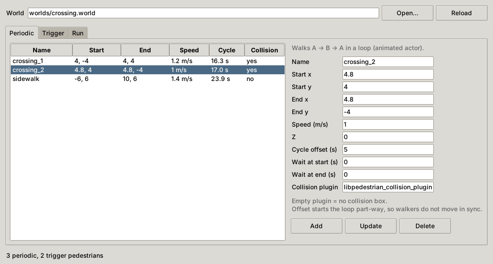
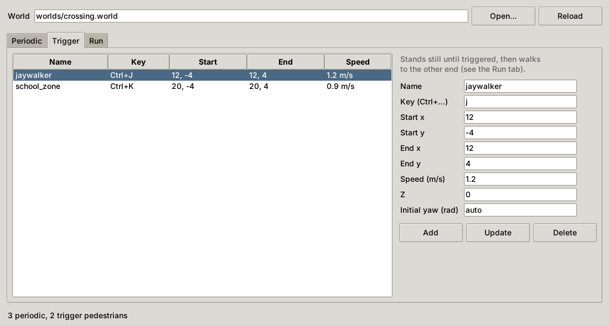

# gazebo-pedestrian-injector

Adds walking pedestrians to a Gazebo Classic world file. It supports two
kinds:

- **Periodic:** an animated actor that walks A → B → A forever. Gazebo plays
  it by itself. An optional plugin adds a collision box so vehicles cannot
  drive through it.
- **Trigger:** a person who stands still until you press `Ctrl+<key>` or
  publish to `/<name>/trigger`, then walks to the other end. This is for
  testing how a vehicle reacts to someone stepping onto the road at a chosen
  moment.



## Usage

Needs Python 3.8+. The editor needs tkinter. Trigger pedestrians also need
ROS 2 with `gazebo_ros_pkgs`. Keyboard triggers need pynput and an X11
session.

```bash
python3 gazebo_pedestrian_injector.py track.world        # editor window
python3 gazebo_pedestrian_injector.py --help             # all commands

python3 gazebo_pedestrian_injector.py add-periodic track.world crossing_1 --start 4 -4 --end 4 4 --offset 3
python3 gazebo_pedestrian_injector.py add-trigger  track.world jaywalker  --start 12 -4 --end 12 4 --key j
```

`--offset` starts a walker part-way through its loop, so several walkers do
not move in step. `--wait-start` and `--wait-end` add pauses at each end.



## Trigger pedestrians

Start Gazebo with the world, then run the controller (or use the Run tab in
the editor):

```bash
python3 gazebo_pedestrian_injector.py run track.world
```

Each trigger pedestrian uses these topics:

| Topic | Type | |
|---|---|---|
| `/<name>/trigger` | `std_msgs/Empty` | walk to the other end |
| `/<name>/state` | `std_msgs/String` | `at_a`, `at_b`, `to_a`, `to_b` (latched) |
| `/<name>/cmd_vel`, `/<name>/odom` | | to and from `libgazebo_ros_planar_move` |

A test node can trigger a pedestrian when the vehicle passes a given point
and wait for `at_b`, so the scenario does not depend on someone pressing a
key at the right moment. The pedestrian walks on odometry feedback: it always
reaches the end point and turns to face the way it walks.

## Collision plugin

Actors have no collision in Gazebo Classic. `plugin/` contains a small plugin
that moves a box along with the actor. Build it once:

```bash
cmake -S plugin -B plugin/build && cmake --build plugin/build
export GAZEBO_PLUGIN_PATH=$PWD/plugin/build:$GAZEBO_PLUGIN_PATH
```

To add an actor without the box, use `--no-collision` or leave the plugin
field empty.

## Notes

- Gazebo Classic only. Actors work differently in Gazebo Fortress and
  Harmonic, and `libgazebo_ros_planar_move` does not exist there.
- Pedestrians are written between marker comments in the world file. The
  rest of the file is not touched.
- Trigger pedestrians use the `person_standing` model from the Gazebo model
  database, so it has to be in `~/.gazebo/models` or on `GAZEBO_MODEL_PATH`.

## License

Apache-2.0
